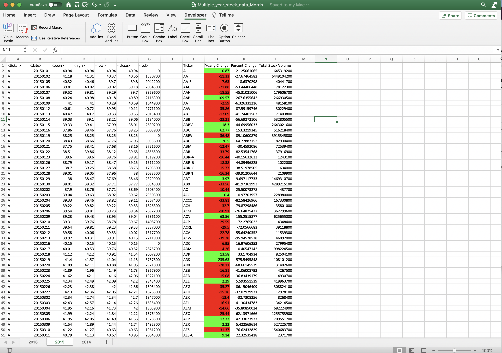
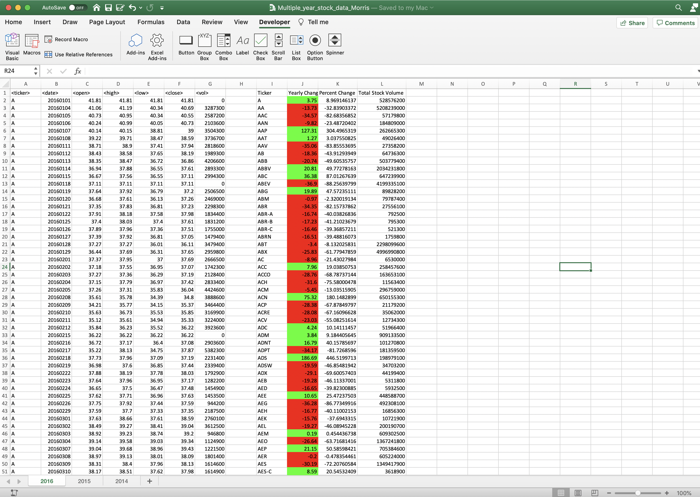

# VBA Scripting - Stock Market Analysis

In this project I used VBA scripting to analyze stock market data pulled from the years 2014-2016. Using these datasets, I successfully rendered several financial analyses outputs relative to company performance including the total volume of stock, yearly changes and percent changes between opening and closing prices. The VBA script within this assessment accurately runs through every worksheet contained in the .bas file, so that the financial analysis can be performed correctly across all years by running the code one singular time. 

### Files

* [Test Data](Resources/alphabetical_testing.xlsx) - Used this dataset while initially developing my scripts given its smaller size.

* [Stock Data](Resources/Multiple_year_stock_data.xlsx) - Used this dataset to generate the final financial analysis report.

## Baseline Financial Analysis

* Using VBA scripting within Microsoft Excel, I was able to create a script that loops through all the stocks for one year and output points of interest for each stock including:

  * The ticker symbol

  * Yearly change from opening price at the beginning of a given year to the closing price at the end of that year

  * The percent change from opening price at the beginning of a given year to the closing price at the end of that year

  * The total stock volume

* For an added visual effect, conditional formatting was included to highlight positive changes between opening and closing prices in green and negative changes between opening and closing prices in red.

* Resulting 2014 Stock Market Financial Anaylis Output:

* Resulting 2015 Stock Market Financial Analysis Output:

* Resulting 2016 Stock Market Financial Analysis Output:

## Percentage Fluctuation and Greatest Total Volume

* The financial analysis output also returns the stock with the "Greatest % increase", "Greatest % decrease" and "Greatest total volume".

* Resulting output is displayed as follows:

- - -

### Copyright

Trilogy Education Services © 2020. All Rights Reserved.
